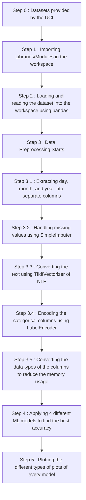

# <p align="center">💊ML-Project-Drug-Review-Dataset💊</p>

<!-- --------------------------------------------------------------------------------------------------------------------------------------------------------- -->

<div id="top"></div>

<h2>Table of Contents🧾</h2>

- [Introduction📌](#introduction)
- [Technology Used🚀](#technology-used)
- [Dataset Used📊](#dataset-used)
- [Getting Started💥](#getting-started)
- [Proposed Methodology⭐](#proposed-methodology)
- [ML Models Used🚀](#ml-models-used)
- [Results Analysis Screenshots📈](#results-analysis-screenshots)
- [Further Works💫](#further-works)
- [Contributing Guidelines📑](#contributing-guidelines)
- [Code Of Conduct📑](#code-of-conduct)
- [Project Admin⚡](#project-admin)
- [Contributing is fun🧡](#contributing-is-fun)
<br>

<!-- --------------------------------------------------------------------------------------------------------------------------------------------------------- -->

<h2>Introduction📌</h2>

This is an innovative machine learning project that utilizes patient reviews with many other attributes to analyze and evaluate the effectiveness of different drugs in treating specific conditions. By training on a vast dataset of patient experiences, the model can provide insightful ratings for the available drugs, based on their real-world usage.<br><br>
The project demonstrates the power of advanced machine learning techniques to extract meaningful insights from unstructured data, ultimately enabling more informed decision-making in the healthcare industry.

<!-- --------------------------------------------------------------------------------------------------------------------------------------------------------- -->

<h2>Technology Used🚀</h2>

- `pandas`: This is used for data manipulation and analysis.
- `numPy`: This is used for numerical computing with Python.
- `beautifulSoup`: This is a library used for web scraping purposes to pull data out of HTML and XML files.
- `sklearn`: This stands for scikit-learn which is a popular machine learning library in Python, which provides tools for data preprocessing, classification, regression, clustering, and more. It is widely used in industry and academia for building machine learning models.
- `seaborn`: This is a visualization library based on matplotlib used for making attractive and informative statistical graphics.
- `matplotlib`: This is a plotting library for creating static, animated, and interactive visualizations in Python.

<p align="right">(<a href="#top">back to top</a>)</p>

<!-- --------------------------------------------------------------------------------------------------------------------------------------------------------- -->

<h2>Dataset Used📊</h2>

The dataset used for this project is the famous Drug Review Dataset (Drugs.com) by UCI. The dataset can be found and downloaded from <a href = "https://archive-beta.ics.uci.edu/dataset/462/drug+review+dataset+drugs+com">here</a>.<br>
The data provided is split into a train (75%) a test (25%) partition and stored in two .tsv (tab-separated-values) files, respectively.

<!-- --------------------------------------------------------------------------------------------------------------------------------------------------------- -->

<h2>Getting Started💥</h2>

- Fork this Repository.
- Clone the forked repository in your local system.
```
git clone https://github.com/<your-github-username>/ML-Project-Drug-Review-Dataset.git
```
- Open the project folder in any local editor like Visual Studio Code.
- Run the file `main.py`.
<p align="right">(<a href="#top">back to top</a>)</p>

- Raise an issue if you find a bug or add a feature.
- Wait for the issue to be assigned and proceed only after the issue is assigned to you.
- Navigate to the project directory.
```
cd ML-Project-Drug-Review-Dataset
```
- Create a new branch for your feature.
```
git checkout -b <your_branch_name>
```
- Perfom your desired changes to the code base.
- Track and stage your changes.
```
# Track the changes
git status

# Add changes to Index
git add .
```
- Commit your changes.
```
git commit -m "your_commit_message"
```
- Push your committed changes to the remote repo.
```
git push origin <your_branch_name>
```
- Go to your forked repository on GitHub and click on `Compare & pull request`.
- Add an appropriate title and description to your pull request explaining your changes and efforts done.
- Click on `Create pull request`.
- Congrats! 🥳 You've made your first pull request to this project repo.
- Wait for your pull request to be reviewed and if required suggestions would be provided to improve it.
- Celebrate 🥳 your success after your pull request is merged successfully.

<p align="right">(<a href="#top">back to top</a>)</p>

<!-- --------------------------------------------------------------------------------------------------------------------------------------------------------- -->

<h2>Proposed Methodology⭐</h2>
<h3 align="center">A. WORKFLOW OF THE PROJECT</h3>


<p align="right">(<a href="#top">back to top</a>)</p>

<h3 align="center">B. DETAILED IMPLEMENTATION PLAN</h3>

<p>1️⃣ Importing the necessary libraries and modules such as pandas, numpy, warnings, BeautifulSoup, MarkupResemblesLocatorWarning, SimpleImputer, ConvergenceWarning, TfidfVectorizer, LabelEncoder, LinearRegression, LogisticRegression, Perceptron, DecisionTreeClassifier, mean_squared_error, r2_score, accuracy_score, confusion_matrix, plot_confusion_matrix, seaborn, and matplotlib.</p>
<p>2️⃣ Reading the train and test datasets using pandas read_csv function and store them in train_df and test_df respectively.</p>
<p>3️⃣ Randomly upscaling and selecting 80% of the data from the training dataset using pandas sample function.</p>
<p>4️⃣ Converting the date column to datetime format using pandas to_datetime function.</p>
<p>5️⃣ Extracting day, month, and year into the separate columns using pandas dt attribute.</p>
<p>6️⃣ Suppressing the warnings by using warnings.filterwarnings and warnings.simplefilter functions to make the output look good.</p>
<p>7️⃣ Defining a function decode_html to decode HTML-encoded characters using BeautifulSoup.</p>
<p>8️⃣ Applying the decode_html function to the review column of both the train and test datasets.</p>
<p>9️⃣ Dropping the original date column and the first column using pandas drop function.</p>
<p>1️⃣0️⃣ Handling the missing values using SimpleImputer from scikit-learn.</p>
<p align="right">(<a href="#top">back to top</a>)</p>
<p>1️⃣1️⃣ Assigning the old column names to the new dataframes using pandas columns attribute.</p>
<p>1️⃣2️⃣ Converting the text in the review column to numerical data using TfidfVectorizer from scikit-learn.</p>
<p>1️⃣3️⃣ Replacing the review column with the numerical data using pandas drop function and concat function.</p>
<p>1️⃣4️⃣ Encoding the categorical columns using LabelEncoder from scikit-learn.</p>
<p>1️⃣5️⃣ Converting the data types of columns to reduce the memory usage using pandas astype function.</p>
<p>1️⃣6️⃣ Splitting the train and test datasets into feature variables using pandas drop function.</p>
<p>1️⃣7️⃣ First, applying the LinearRegression model to this project datasets.</p>

- Computing the performance metrics including mean squared error, and r2 score for both training and testing data.<br>
- Plotting and visualizing the scatter plot of predicted vs actual values for training data, testing data, and both training & testing sets.<br>
- Plotting the residual plot for the testing data.
<p>1️⃣8️⃣ Second, applying the LogisticRegression model.</p>

- Computing the accuracy score of this model.<br>
- Plotting and visualizing the accuracy plot and confusion matrix.<br>
<p>1️⃣9️⃣ Third, applying the Perceptron model.</p>

- Computing the accuracy score of this model.<br>
- Plotting and visualizing the scatter plot of actual vs predicted values, step plot of accuracy, and the confusion matrix.
<p>2️⃣0️⃣ Fourth, applying the DecisionTreeClassifier model.</p>

- Computing the accuracy score of this model from epoch range 1 to 10.<br>
- Plotting and visualizing the accuracy vs epoch plot, scatter plot of actual vs predicted values, and the confusion matrix.

<p align="right">(<a href="#top">back to top</a>)</p>

<!-- --------------------------------------------------------------------------------------------------------------------------------------------------------- -->

<h2>ML Models Used🚀</h2>

- LinearRegression
- LogisticRegression
- Perceptron
- DecisionTreeClassifier

<!-- --------------------------------------------------------------------------------------------------------------------------------------------------------- -->

<h2>Results Analysis Screenshots📈</h2>
<p align="center">
  
  <br>
  <em>Figure 1: Results of all the models</em>
</p>

<h3>A. Linear Regression</h3>
<p align="center">
  
  <br>
  <em>Figure 2: Linear Regression - Training Data Scatter Plot</em>
</p><br>
<p align="center">
  
  <br>
  <em>Figure 3: Linear Regression - Testing Data Scatter Plot</em>
</p><br>
<p align="center">
  
  <br>
  <em>Figure 4: Linear regression - Training and Testing Sets Scatter Plot</em>
</p><br>
<p align="center">
  
  <br>
  <em>Figure 5: Linear Regression - Testing Data Residual Plot</em>
</p>
<p align="right">(<a href="#top">back to top</a>)</p>

<h3>B. Logistic Regression</h3>
<p align="center">
  
  <br>
  <em>Figure 6: Logistic Regression Accuracy</em>
</p><br>
<p align="center">
  
  <br>
  <em>Figure 7: Logistic Regression Confusion Matrix</em>
</p>
<p align="right">(<a href="#top">back to top</a>)</p>

<h3>C. Perceptron</h3>
<p align="center">
  
  <br>
  <em>Figure 8: Scatter Plot -- Actual vs Predicted values for Perceptron Model</em>
</p><br>
<p align="center">
  
  <br>
  <em>Figure 9: Step Plot -- Accuracy for Perceptron Model</em>
</p><br>
<p align="center">
  
  <br>
  <em>Figure 10: Perceptron - Confusion Matrix</em>
</p>
<p align="right">(<a href="#top">back to top</a>)</p>

<h3>D. Decision Tree Classifier</h3>
<p align="center">
  
  <br>
  <em>Figure 11: Decision Tree Classifier Accuracy</em>
</p><br>
<p align="center">
  
  <br>
  <em>Figure 12: Decision Tree Classifier - Testing Data Scatter Plot</em>
</p><br>
<p align="center">
  
  <br>
  <em>Figure 13: Decision Tree Classifier - Confusion Matrix</em>
</p>
<p align="right">(<a href="#top">back to top</a>)</p>

<!-- --------------------------------------------------------------------------------------------------------------------------------------------------------- -->

<h2>Further Works💫</h2>

- Enhancing the model's accuracy using advanced machine learning techniques.
- Conducting thorough preprocessing and scaling of the data to enhance model performance.
- Implementing more sophisticated and precise models to improve the results.
- Integrating the project with a website using Flask, HTML, and CSS to showcase accurate results, visually appealing graphs, and plots.

Note: The model's highest accuracy is approximately 50%. Further refinement through training and fine-tuning is required to achieve optimal results.
<p align="right">(<a href="#top">back to top</a>)</p>

<!-- --------------------------------------------------------------------------------------------------------------------------------------------------------- -->

<h2>Contributing Guidelines📑</h2>

Read our [Contributing Guidelines](https://github.com/Rakesh9100/ML-Project-Drug-Review-Dataset/blob/main/.github/CONTRIBUTING_GUIDELINES.md) to learn about our development process, how to propose bugfixes and improvements, and how to build to Music-Recommendation-System.

<!-- --------------------------------------------------------------------------------------------------------------------------------------------------------- -->

<h2>Code Of Conduct📑</h2>

This project and everyone participating in it is governed by the [Code of Conduct](https://github.com/Rakesh9100/ML-Project-Drug-Review-Dataset/blob/main/.github/CODE_OF_CONDUCT.md). By participating, you are expected to uphold this code.
<p align="right">(<a href="#top">back to top</a>)</p>

<!-- --------------------------------------------------------------------------------------------------------------------------------------------------------- -->


<h2>Contributing is fun🧡</h2>

[](https://forthebadge.com)
<h3>Contributions of any kind from anyone are always welcome🌟!!</h3>
<h3>Give it a 🌟 if you ❤ this project. Happy Coding👨‍💻</h3>
<p align="right">(<a href="#top">back to top</a>)</p>
